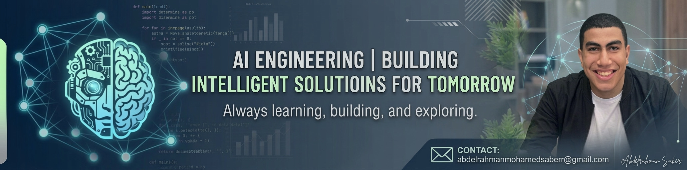

  <a href="https://github.com/abdelrahmansaberr-1/abdelrahmansaberr-1/blob/main/README.md">
     English
  </a>
   
  <a href="https://github.com/abdelrahmansaberr-1/abdelrahmansaberr-1/blob/main/README_ar.md">
     العربية
  </a>

<h2>Hi there!  Welcome to my profile!</h2>

</img>

:space_invader: &nbsp;About Me

&nbsp;&nbsp;&nbsp; :technologist: &nbsp;AI Engineering undergraduate & Content Creator with a strong background in C++, Python, and algorithmic problem-solving. \
&nbsp;&nbsp;&nbsp; :seedling: &nbsp;Currently deepening my expertise in Machine Learning, Deep Learning, Computer Vision, and NLP.\
&nbsp;&nbsp;&nbsp; :heartbeat: &nbsp;Passionate about AI For Business, Tech-Driven Business, and Data Science.\
&nbsp;&nbsp;&nbsp; :writing_hand: &nbsp;Experienced in balancing academics with part-time work, leadership initiatives, and competitive sports.\
&nbsp;&nbsp;&nbsp; :hammer_and_wrench: &nbsp;A proactive learner driven to grow technically and contribute to academic and student communities.\
&nbsp;&nbsp;&nbsp; :rocket: &nbsp;AI Engineer | Data Scientist | Machine Learning & NLP.

  &nbsp;&nbsp;&nbsp;&nbsp;
  &nbsp;&nbsp;&nbsp;&nbsp;

  
<b>:computer: &nbsp;Main tech knowledge</b>

   

&nbsp;
&nbsp;
&nbsp;
&nbsp;
&nbsp;
&nbsp;
&nbsp;
&nbsp;
&nbsp;
&nbsp;
&nbsp;\
&nbsp;
&nbsp;
&nbsp;
&nbsp;
&nbsp;
&nbsp;
&nbsp;
&nbsp;\
&nbsp;
&nbsp;
&nbsp;
&nbsp;
&nbsp;
&nbsp;
&nbsp;

  
<b>:brain: &nbsp;Other knowledge & Soft Skills</b>

   

&nbsp;
&nbsp;
&nbsp;
&nbsp;\
&nbsp;
&nbsp;
&nbsp;\
&nbsp;
&nbsp;

  
<b>:gear: &nbsp;GitHub Statistics</b>

   
    

        
    

    

         
    

